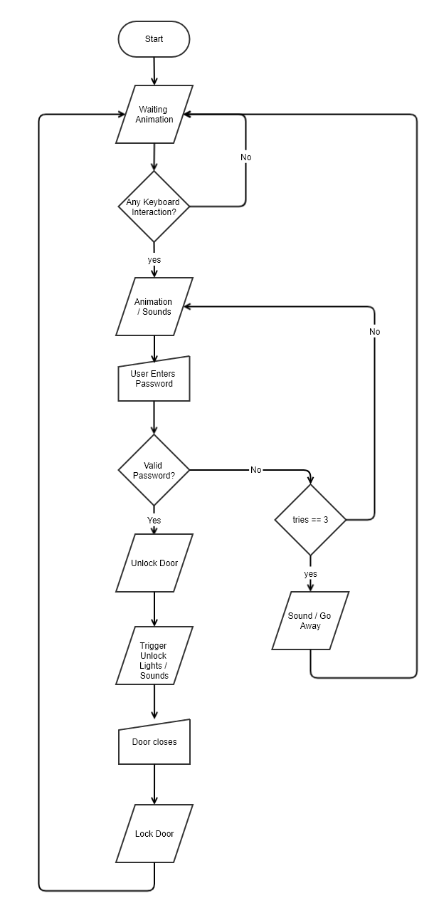
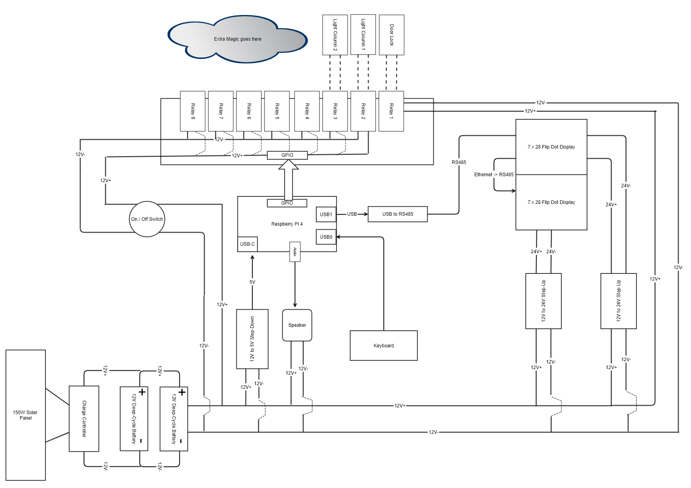

This page holds the design for the 2019 Burning Man Project Liminal Entanglement. 

## Design Decisions

Initially, we wanted multiple terminals in which users could interact with terminals spread across the playa. These 
terminals would interact via wifi. However, technical limitations on the distance of wifi and possibly congested RF spectrum
made us re-focus on a single terminal design. We have settled on having a single "terminal" located with the door which 
will reduce cost, and provide for a more meaningful interaction with the door. 

- Power will be provided by deep cycle batteries with solar panels. 
- The flip-dot board requires 2 x 24V DC power. Initially it was thought that we should connect the batteries in series
to get 24V out, however research has shown that this may negatively affect the ability to charge the batteries. Instead 
the batteries will be connected in parallel. 
- Raspberry Pi was chosen over arduino due to the number of inputs and outputs required, along with the ease of using
on-board USB, audio out, and on-board storage. 
- We will leverage existing libraries to control the flip-dot board. 

Open questions are located [here](research.md).

## Terminal With Door Flow

Below is the logic flow assuming the door is co-located with the terminal.

### Circuit Diagram

### Original Diagram

